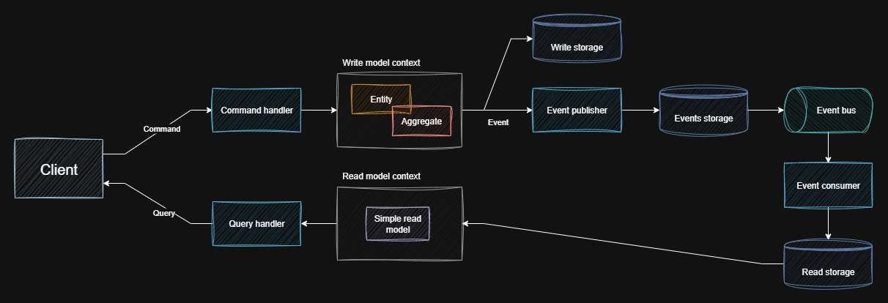

## Architecture

### Layers

The architecture will be described starting with the layers. The project uses a clean architecture approach with a clear separation of responsibilities. I would like to emphasize that the **Hosts** folders contain any projects that can be run (for example, Web API or console applications). In general, considering all layers, here is their description:

- **Domain** - serves as an independent, central, and key layer. It defines the subject area of the business and describes business rules, aggregates, entities, and value objects
- The next layer - **Applications**, which is divided into 2 sublayers:
    - **AppServices** - acts as an orchestrator between Domain and Infrastructure. It is responsible for managing the execution of business logic
    - **Handlers** - contains handlers for CQRS primitives (commands, queries, events) that work with app services.
The next layer is **Infrastructures**, which contains the implementation of technical details. In general, it is divided into the following layers in the project to avoid monolithism:
    - **DataAccess** - responsible for working with data from external storage
    - **FileStorage** - responsible for storing and retrieving files from external systems (in my case, from MinIo)
    - **BackgroundJobs** - manages background task execution (in my case via Hangfire)
- There is also an auxiliary layer called **Contracts**, which contains components for interacting with external resources or modules. In addition, it may also contain mappers, common constants, and options.
- In **Hosts**, there is an **Api** layer, which is responsible for interacting with external resources, and there may also be a **Migrations** layer, which contains scripts that describe the structure of the database schema, which can be run through a console application, providing automation to the process
- The **Clients** layer is also used to interact with various external APIs

### Modular Monolith

Modular monolith was chosen as an architectural approach to reduce the entropy inherent in classic monolithic systems and, at the same time, introduce a structured organisation of the system. Why not microservices? To postpone their operational complexity in use. In a modular monolith, the architecture consists of different modules that ultimately form a single whole. These modules are independent and responsible for a specific fragment of business logic. At the same time, in the future, it will be easy to migrate from a modular monolith to microservices, since the modules are already isolated. You can read more about modules in the corresponding section on modules - [see here](https://google.com/).

All modules have a common **Common** layer, which sets the standard for different layers, contains ready-made solutions and various common components. It also contains the main abstractions. The layers of all modules depend on the corresponding Common layers.

The modular monolith itself is implemented as a distributed modular monolith. Each individual module with business logic has its own database. In general, this allows for a fair distribution of the load. One module that requires more work with the database will not overload the entire database and slow down other operations.

### Domain-Driven Design

In the project, the system is structured around business domains and clearly defined contexts. The system is divided into subdomains, which are grouped according to their role in the business model. Each module belongs to a specific type of subdomain. Additionally, the internal logic of one subdomain does not violate the invariants of another. The subdomains of the modules are shown below:

| Category | Modules | Description |
|----------|----------|----------|
| Core supdomain | BankAccounts, Budgets | Core business logic. Here, the focus is on unique business rules. |
| Supprting supdomain | Reports, Notifications | Assist the core, but are not unique. They respond to events from the core and do not affect the main logic. |
| Generic supdomain | Secutity, Webhooks | Cross-domain services that can be extracted into separate bounded contexts or used as a shared kernel |

Below is a brief description of the subject area of each core subdomain:

#### BankAccounts

Consists of the **Account** aggregate and the **Transaction** entity. Each user can create an account and a corresponding transaction for that account. When creating a transaction, the emphasis is on its type, whether it is income or expense, and accordingly, the account is increased or decreased. 

#### Budgets 

Consists the **Budget** aggregate and the **BudgetCategory** entity. A user can create a budget for a specific period of time, which consists of categories. These categories correspond to a specific area of expenditure and contain a specified limit. When the limit is exceeded, a notification is sent to the user.

### Event-Driven Design

Events are used to establish inter-module communication in isolated modules. Module A sends an event, and module B responds to it accordingly. The events themselves simply transfer data from one module to another and notify about the execution of the necessary action. To send such events, the **RabbitMq** message broker is used, which provides asynchronous communication, abstraction, and simplification of logic using **MassTransit**. To ensure eventual consistency, a common practice is used in the form of an **Outbox pattern**, implemented through **MassTransit** and integrated into EF Core. Events are stored in the Events database, where **PostgreSQL** is used as a DBMS.

The following are among the common events in the system:
- Notifying the system about account creation or deletion
- System notification of transaction creation or deletion
- System notification of budget creation or deletion
- System notification of creation or deletion of budget categories that contain limits
- Working with webhooks
- User notification by sending emails

### CQRS

The division into **commands** and **queries** is used to process operations differently, those that change the state of the system and those that only return data (do not change the state of the system). The API architecture utilises the idea of storing data differently: a normalised structure is used for the **write model**, and a denormalised structure is used for the **read model** to gain speed by avoiding excessive JOIN queries. To separate the data, an approach of dividing it into separate write and read schemas within a single database is used. At the EF Core level, there are also two contexts: **write** and **read**. This is all within the **PostgreSQL** DBMS.

*[img. 1.0]*

To ensure data consistency in both models, an asynchronous approach via **RabbitMq** is used. When performing an operation that changes the system, the changes are written to the write model and an event is sent, and the corresponding event handler (consumer) intercepts it and writes the data to the read model.

Among the possible improvements, data can be separated at the level of different databases: a relational database for writing and a non-relational database for reading, which is ideal for reading data.

#### Handlers

Handlers act as intermediaries between the API level and business logic. They delegate entity service calls by continuing the chain. The general chain of calls looks like this: Endpoint -> Handler -> EntityService -> Repository -> ExternalStorage.

#### Cross-Cutting Concerns

To avoid mixing additional behaviour with the main logic of handlers and to adhere to the **Single Responsibility Principle**, the **Decorator pattern** is applied around them. Handlers are wrapped with the following additional layers:

- **Validation decorator** - validates input data (commands and queries) before the handler starts working. Uses validation rules via the **Fluent Validation** library.
- **Transaction decorator** - opens a transaction before calling the handler and commits or cancels changes after completion.