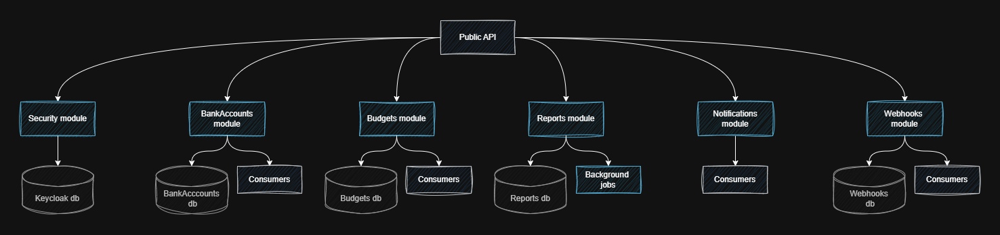
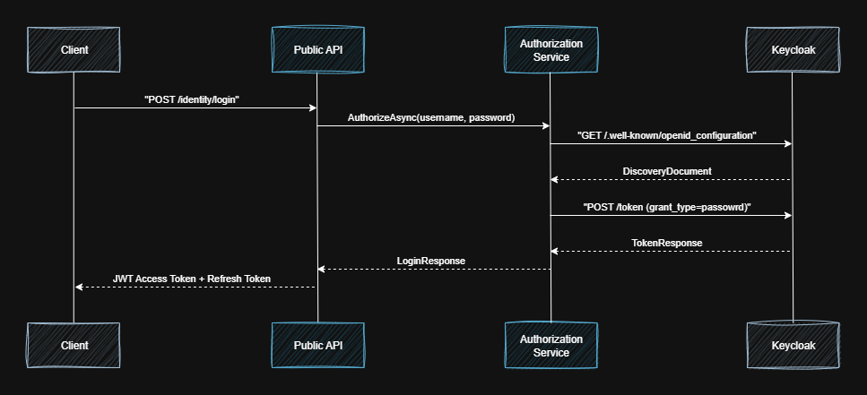
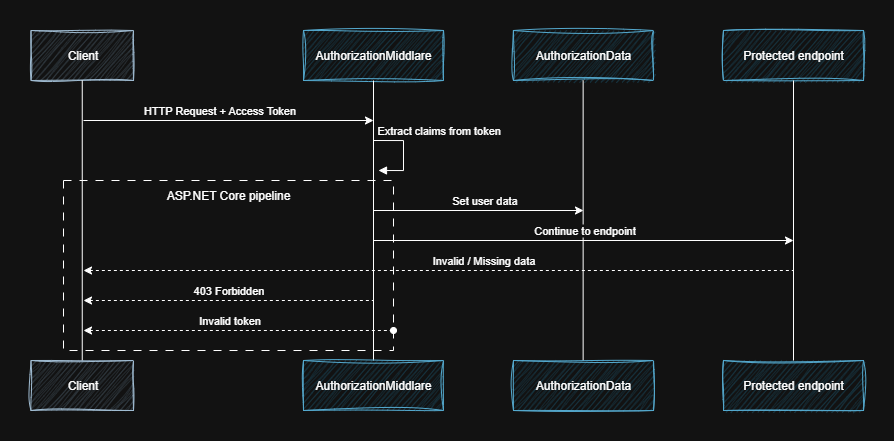

## Modules



*[img. 1.1]*

### Security 

The security module is the first component with which the client begins interaction. It is responsible for identity management, authentication, authorization, and user management. To implement these processes, the module is integrated with a ready-made identity provider — **[Keycloak](https://www.keycloak.org/)**, which provides user registration, login/logout, token management, and session tracking. Keycloak integration is based on client architecture: special API clients interact with the **Keycloak server** to perform various operations. The system uses both generated clients for the **Admin API** and its own HTTP clients to implement OAuth flows. The module generates requests to the Keycloak API and processes the results accordingly. Authentication is implemented using the **JWT Bearer** approach with support for **refresh tokens** and **RSA256** asymmetric encryption. The general authentication process is shown below:



*[img. 1.2]*

After successful authentication, tokens are stored in **cookies**. The client takes the **access token** and adds it to the header of each request. When a request arrives at the API, **Authorization Middleware** extracts user data from the token and writes it to a special structure, which is then passed to the relevant components that need access to user data. If the access token expires, the client must request a token refresh via a **refresh token**. The sequence of middleware operations is demonstrated below:



*[img. 1.3]*

In general, in order to pass authentication, you need to confirm your email address after creating an account. A letter will be sent to the specified email address; you should follow the link. After following the link, the user's status in the Keycloak system will change to email verified, after which you will be allowed to log in to the system.

#### Keycloak

Keycloak is quite easy to configure. It uses:

- **Admin realm** - for the admin client (admin-cli), which interacts with generated components
- **Own realm (SmartLedger realm)** - for requests from external APIs

To configure Keycloak locally (version 26.4.1):

1. Go to http://localhost:8090/
2. Enter the login/password admin/adminp4ss
3. In **master realm**, open **Realm Settings -> Action -> Partial Import**, and upload the `realm-export-master.json` file from [keycloak/imports](https://github.com/1args/SmartLedger/tree/development/docker/keycloak/import)
4. Create your own realm:
   - click **Manage Realms -> Create Realm**,
   - in the **Resource file** field, select `realm-export-smartledger.json`
   - Specify the name **"SmartLedger"**
5. In all `appsettings.*.json` files where Keycloak is used, you need to set Secrets
   - For **AdminSecret**, you need to go to **master realm -> Clients -> admin-cli -> Credentials -> copy Client Secret**
   - For **ClientSecret**, go to **SmartLedger realm -> Clients -> smartledger-api-client -> Credentials -> also copy Client Secret**
   - If there are no generation buttons, restart the page
6. Paste the copied Secrets into similar files:
```
"KeycloakAuthorizationOptions": {
  "ClientId": "smartledger-api-client",
  "ClientUuid": "45d5a3d7-4454-498b-ad59-76c59378dc70",
  "ClientSecret": "5ckk3AXS3tgxtUHzuffSkst3MR6Td3jh", // Secret for the smartledger-api client in SmartLedger realm
  "Realm": "SmartLedger",
  "MetadataAddress": "http://localhost:8090/realms/SmartLedger/.well-known/openid-configuration",
  "AdminClient": "admin-cli",
  "AdminSecret": "Me8ADstfTuRxfSCnEXKYJFE0wsbphuH1", // Secret for the admin-cli client in master realm
  "AdminBaseUrl": "http://localhost:8090",
  "Authority": "http://localhost:8090/realms/SmartLedger",
  "AdminRealm": "master",
  "TokenValidationOptions": {
    "Issuer": "http://localhost:8090/realms/SmartLedger",
    "Audience": "Use in the production enviroment",
    "ValidateIssuerSigningKey": true,
    "ValidateIssuer": true,
    "ValidateAudience": false,
    "ClockSkew": "00:02:00"
    }
  }
```

### BankAccounts

This module is responsible for working with accounts and transactions. The user creates an account and can create corresponding transactions for it. There are two types of transactions: expenses and income, and different categories. The maximum transaction amount is 100,000 at a time. The transaction must also contain notes about its purpose. This module contains a basic set of operations for accounts and transactions: creation, deletion, retrieval. 

### Budgets

The budgets module is the second key component that implements the business logic of the system. It is responsible for creating and managing budgets that have a defined period of validity and a list of categories.

Each budget category corresponds to a specific financial category and contains:

- the set limit for the budget period,
- the amount spent,
- the current status (e.g., active or exceeded).

It is important to note that a budget can only contain one category for each financial category. To calculate the amount spent, the amount from the transaction with the expense type is taken and added to the amount spent. If the amount spent exceeds the limits, the user is sent a notification about this by email. The module also provides a basic set of operations: creating, deleting, and receiving budgets.

### Webhooks 

This module is responsible for interacting with external systems in real time by sending responses to the specified callback URL. The client must create a webhook using an appropriate request that contains a specific event type and the URL to which the information will be sent. After that, during the dispatch event, the system searches for webhooks that match the required event type. Next, a request with data is formed and sent to the specified URL, and at the same time, the result of the request execution is saved.

### Reports 

The reporting module is responsible for providing analytical information on accounts, transactions, budgets, and limits. In this module, reports are generated in the background via **Hangfire**. The **PuppeteerSharp** and **Handlebarrs** libraries are used to build reports. The generated reports are stored in file storage and information about them is stored in the database. Also, after the report is generated, data about the report is sent via a webhook to the corresponding URL. The report itself is obtained with an additional request.

You can view a sample report by **[clicking here](https://github.com/1args/SmartLedger/blob/development/docs/files/file-1-0.pdf)**.

### Notifications

This module is the simplest of all. It is used to send emails to users' mailboxes when certain triggers are activated. Sending is implemented via the SMTP strategy, although it is possible to use others. Other modules send a sending event, and this module listens to it and sends emails.